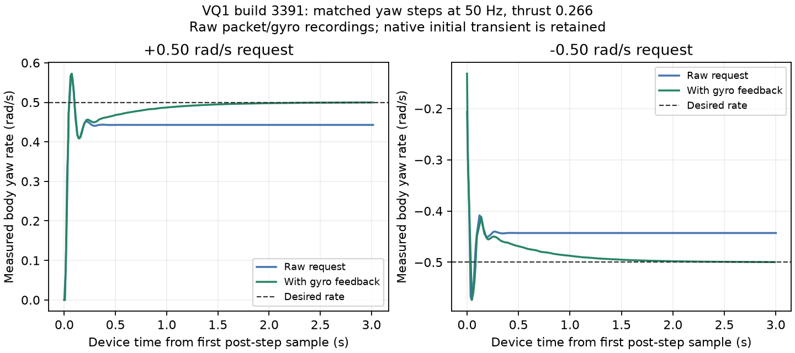

# VQ1 yaw-rate tracking

This study concerns VQ1 build 3391, executable SHA-256
`d5bec020a98a0def0bf5b124b57d38189e78fbb173a5ec81697aad25c0efbec9`.
It separates the nominal rate a routine wants, the rate request transmitted to
the simulator, and the angular velocity the simulator actually produces.

## Diagnosis

Two-second level yaw steps were repeated after a settled position hold. The
baseline sent the requested rate unchanged apart from the existing FRD-to-wire
sign conversion. Exact outgoing packets, accepted sensor packets, controller
inputs/outputs, source hashes, and the executable hash were retained.

The final half-second of six positive/negative 0.25 rad/s trials measured a gain
of 0.8857663–0.8857672. Two-second 0.75 rad/s steps gave the same gain. Changing
command cadence or using thrust 0.264 instead of 0.266 did not remove the deficit.
Gyro readings and independently unwrapped attitude changes agreed. Three-second
0.5 rad/s baseline steps still settled at approximately 0.442883 rad/s.

The cadence comparison used measured successful-send intervals: approximately
20 Hz and 50 Hz. A run configured for 90 Hz delivered about 56 Hz at the median;
fresh-observation availability and host scheduling limit the actual cadence.

Read-only inspection of the installed VQ1 executable located these operations:

| VQ1 virtual address | Operation observed |
| --- | --- |
| `0x14104b4f0` | Decode `SET_ATTITUDE_TARGET`; copy its rate values and radians flag into the input record |
| `0x14104e510` / `0x14104ac50` | Store/read that record through the input buffer |
| `0x141394cd0` | With the radians flag set, convert rates to degrees/sec and invert the axis rate curves |
| `0x1413901e0` / `0x14138fef0` | Inverse and forward rate-curve calculations using matching axis settings |
| `0x14138ed80` / `0x14138ffb0` | Form desired rates and evaluate native rate PID terms |

The wire values, mask 144, and frame conversions were consistent. The persistent
loss is in the target's command-to-motion response, not a reason to redefine
radians or silently change the packet encoder. The study does not identify a
unique native PID coefficient as the cause; native controller state and tuning
were not instrumented. No simulator binary, physics, or PID settings were changed.

## Experimental rate correction

`target/aigp/experiments/yaw_tracking.py` supplies `YawRateFeedback`, selected
by the rate probe's `--yaw-feedback` option. It learns a bounded yaw correction
from the difference between the requested rate and the measured gyro rate.
It contains no fixed inverse-gain multiplier and does not modify roll, pitch,
or thrust.

The defaults are an integral gain of 2/s, correction limited to ±0.15 rad/s, and
the resulting yaw request limited to ±1 rad/s. Error is integrated against the
previous request, which was active during the elapsed sensor interval. After a
reference step larger than 0.05 rad/s, integration pauses for 0.15 seconds to let
the native initial transient pass. Zero requests remain exact zero; mode changes,
missing required observations, and invalid/gapped sample intervals reset state.
This preserves the explicit neutral request needed before returning to a NED
command. The existing runner still owns arming, freshness checks, and cleanup.

`position_control()` in the generic core and `SimulatorClient` retain their
original calculation and encoding. The R1 gate routine sends the position
controller's output directly. Sustained rate tracking in these probes does not
establish a need for another yaw-rate loop in a routine that already controls
heading. The correction remains an explicit VQ1 experiment.

## Validation

The final correction was tested on 0.5 rad/s requests. Measurements below
are means over the final 0.5 device seconds of matched three-second steps, with
thrust 0.266 and 50 Hz requested cadence:

| Requested rate | Raw measured rate | With feedback | Raw error | Feedback error |
| --- | --- | --- | --- | --- |
| +0.5 rad/s | +0.442883 | +0.499467 | 11.423% | 0.107% |
| −0.5 rad/s | −0.442883 | −0.499452 | 11.423% | 0.110% |

The initial peak remains approximately 14.5% above the requested magnitude in
both versions. The feedback's transient pause avoids turning that native initial
response into an integral correction. Four two-second ±0.5 trials ended with
0.61–0.66% error. A further ±0.75 rad/s test at 20 Hz and thrust 0.268 ended with
0.61–0.68% error. Both signs, different command cadence, and a changed thrust were
checked without retuning the correction. Every completed final probe replayed
its controller outputs exactly.

The version of `r1_body_rates` at commit `30c073a`, which included the correction,
completed all six native R1 gates with 2,241 controller updates replayed exactly
and no reported collisions. The owned simulator and connection closed.
Validation also passed 240 unit tests, seven
UDP integration checks, and 24 core checks with site packages disabled. That
historical flight trace requires that controller version to replay; the current
gate routine uses the original position feedback without this extra loop.



## Reproduce

From the repository root, with the AIGP dependencies installed:

```sh
python -m examples.aigp.probe_body_rates yaw baseline.jsonl --thrust .266 --rate .5 --duration 3
python -m examples.aigp.probe_body_rates yaw tracked.jsonl --thrust .266 --rate .5 --duration 3 --yaw-feedback
python -m examples.aigp.probe_body_rates analyze baseline.jsonl
python -m examples.aigp.probe_body_rates analyze tracked.jsonl
python -m examples.aigp.probe_body_rates replay tracked.jsonl
```

Use unused filenames; recordings are never overwritten. `--repeat` repeats a
sequence and `--hz` sets the requested cadence below 100 Hz. Only yaw-only
sequences may use steps up to three seconds; roll/pitch and thrust-only probes
retain the one-second cap. The existing motion envelope and wall-clock deadline
remain active. Camera input is disabled for these measurements.
The probe inserts a neutral body-rate step before position recovery even when a
caller supplies only the nonzero pulses; callers need not build that handoff.

The analyzer decodes the actual packet bytes. For feedback runs it uses the
separately recorded nominal requests to define steps and reports transmitted
rates separately. Host receipt times associate packets with requests, while
device timestamps define the final measurement window and attitude slope.
Failed runs and insufficient data are rejected. `--tail` changes the final
measurement window, which defaults to 0.5 seconds.

The local raw traces and investigation artifacts are in
`target/aigp/.runtime/measurements/yaw-response/`. The small checked-in packet
fixture in `test/fixtures/vq1_yaw_tracking.json` preserves a baseline and corrected
step for regression checks. The decompiled vendor code is not part of the patch.

These results establish a bounded VQ1 controller correction. They do not establish
VQ2 behavior, hardware timing, aggressive coupled rotations, or exact tracking
when the correction/output limits are reached. The native initial step transient
still exists; this correction addresses the persistent tracking deficit.
